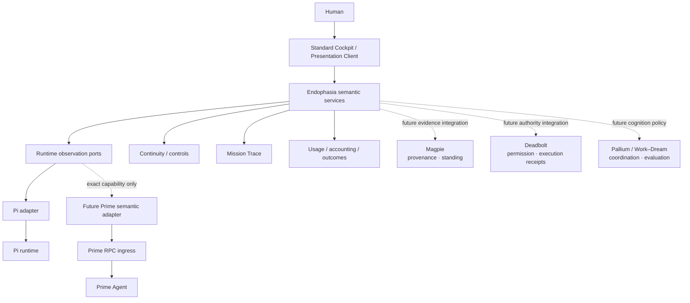

<a id="endophasia"></a>

<div align="center">

<p><sub>WORK &nbsp; / &nbsp; DREAM &nbsp; / &nbsp; OBSERVE &nbsp; / &nbsp; VERIFY</sub></p>

<h1>endophasia</h1>

<p><strong>Instrumented cognition for coding agents.</strong></p>

<p>
An experimental systems workbench for making agent computation<br>
<strong>visible, steerable, inspectable, and governable.</strong>
</p>

<p>
  <a href="#current-state"></a>
  <a href="https://github.com/earendil-works/pi"></a>
  <a href="#runtime-model"></a>
  <a href="LICENSE"></a>
</p>

<p>
  <a href="#why-endophasia">Why</a> &nbsp; · &nbsp;
  <a href="#what-exists-today">Today</a> &nbsp; · &nbsp;
  <a href="#runtime-model">Runtimes</a> &nbsp; · &nbsp;
  <a href="#work--dream">Work / Dream</a> &nbsp; · &nbsp;
  <a href="#architecture">Architecture</a> &nbsp; · &nbsp;
  <a href="#where-this-is-going">Roadmap</a>
</p>

</div>

---

Most coding-agent interfaces show the prompt, the tools, and the answer.

The interesting system is increasingly everything around the model:

```text
context selection
runtime state
branching
compaction
usage accounting
verification
human steering
permission
evidence
presentation
```

**Endophasia turns that surrounding harness into an instrument panel.**

It is not a chain-of-thought viewer and it is not an agent-swarm dashboard. The goal is to expose what can actually be established about an agent run, preserve the distinctions that matter, and keep cognition separate from truth and authority.

> [!IMPORTANT]
> **Endophasia is experimental.** The current production path is still Pi-backed. A runtime-neutral observation boundary now exists, and Prime Agent is being evaluated and integrated behind that boundary without weakening Endophasia semantics to make different runtimes look artificially identical.

## Why Endophasia

A capable agent should be allowed to reason flexibly without making its surrounding system vague.

The project is built around a few recurring separations:

```text
observation  ≠ inference
acceptance   ≠ execution
evidence     ≠ standing
proposal     ≠ permission
history      ≠ active context
configured   ≠ in-flight
accounting   ≠ context occupancy
```

The system should tell the truth about what it knows.

If an event was observed, expose the event.

If a value was derived, mark it as a projection.

If a runtime cannot supply a semantic contract exactly, leave the capability unavailable rather than inventing parity.

A short version:

```text
Endophasia exposes and steers.
Pallium experiments with cognition.
Magpie governs epistemic memory.
Deadbolt governs consequential action.
```

Those layers may cooperate later. None silently inherits the authority of another.

## What exists today

Endophasia has moved well beyond the original architecture sketch. The merged Pi path now includes a working runtime, remote services, browser presentation, and a set of deliberately narrow semantic instruments.

| Surface | Current state |
| :--- | :--- |
| **Mission Trace v0** | Structural lifecycle projection over real runtime events, with bounded remote observation and a Standard Cockpit instrument. |
| **Continuity Inspector v0** | Read-only durable ancestry plus Pi's compaction-bounded context-source window. It does not claim to be the provider-visible prompt. |
| **Steering Controls v0** | Bounded STEER / QUEUE / STOP operations with payload-minimal receipts. Acceptance is not represented as execution or completion. |
| **Session Overview v0** | Per-lane session state with explicit non-atomic semantics. |
| **Durable Outcomes v0** | Immutable terminal operation records on the Pi path. |
| **Runtime Metrics v0** | Explicit cumulative session accounting capture, kept separate from current-context occupancy and provider billing. |
| **Usage Ledger / Feed v0** | Durable usage paging plus gap-safe live observation with session-global sequence semantics. |
| **Usage Observation v0** | Bounded live usage state and page access in the Standard Cockpit. |
| **Runtime Control Deck v0** | Read/write runtime controls while preserving the distinction between configured state and an already captured in-flight operation. |
| **Endophasia Runtime v0** | Source-only Chord server + Session worker with real multiprocess end-to-end coverage. |
| **Presentation Client v0** | Headless typed client over the Endophasia service surface. |
| **Standard Cockpit v0** | Browser UI for Sessions, transcript, Mission Trace, accounting, usage, controls, and degraded-state handling. |
| **Browser ByteTransport v0** | Browser transport with guarded presentation error handling and a strict bundle boundary. |
| **Runtime Observation Boundary v0** | Four Pi-free observation capability ports with the Pi implementation moved behind a runtime-specific adapter. |
| **Prime Runtime Conformance v0** | Research probe that tests whether Prime can satisfy Endophasia contracts without semantic misrepresentation. |

The current browser/presentation path is intentionally a **projection**, not a second source of truth:

```text
runtime
  │
  ▼
runtime adapter
  │
  ▼
Endophasia semantic services
  │
  ├─ Chord replicated state
  ├─ read-only service calls
  └─ explicit control calls
       │
       ▼
Presentation Client
       │
       ▼
Standard Cockpit
```

The UI should not reverse-engineer semantics from display strings or raw runtime payloads.

## Mission Trace

Mission Trace is the normalized observable timeline of a run.

It records semantic lifecycle structure without exposing hidden private reasoning:

```text
mission.started
turn.started
model.started
model.completed
tool.started
tool.completed
mission.completed
mission.failed
mission.aborted
```

The exact vocabulary is intentionally small. It is derived only where the runtime supplies enough evidence.

The current Pi implementation is:

- sequence-numbered;
- streaming;
- non-retaining at the observation source;
- bounded to the latest 1024 events at the remote replicated-state surface;
- payload-minimal;
- independent from Usage and Runtime Metrics.

A sequence beginning above 1 means the bounded worker-lifetime window dropped earlier events. It does **not** imply that some durable Mission Trace history can be fetched elsewhere.

That distinction is deliberate.

## Continuity and context

A flat transcript is not enough to describe a long-running agent.

Endophasia distinguishes durable history from the active context projection used to continue work:

```text
DURABLE HISTORY
    │
    ├─ entries
    ├─ branches
    ├─ compaction records
    ├─ summaries
    └─ runtime changes
         │
         ▼
ACTIVE CONTEXT SOURCE WINDOW
         │
         ▼
next model request
```

The existing Continuity Inspector exposes durable ancestry and Pi's compaction-bounded context-source window.

It does **not** claim to reconstruct the exact provider-visible prompt.

Future continuity work should preserve the same discipline: observation before inference, and explicit uncertainty where the runtime does not expose enough information.

## Usage, accounting, and outcomes

Endophasia keeps three superficially similar signals separate.

```text
Mission Trace
    live structural lifecycle

Runtime Metrics
    explicit cumulative accounting capture

Usage Ledger / Observation
    durable usage records + bounded live tail

Operation Outcome
    immutable terminal operation result
```

These are not interchangeable.

A Usage row does not establish a lane, operation, provider, model, timestamp, or cause unless that information is actually part of the contract.

Runtime Metrics is not derived from Usage rows.

An accepted STOP request is not an Operation Outcome until the operation actually settles.

This is representative of the wider design: avoid joins that look convenient but create facts the underlying evidence never established.

## Steering

Long-running agents need richer interaction than another chat message.

The current Pi-backed controls preserve three distinct actions:

```text
STEER   alter the active trajectory using Pi's steering queue
QUEUE   deliver work at Pi's follow-up boundary
STOP    request abort of the observed run
```

Receipts record that the runtime accepted the request. They do not claim the request was consumed or that the operation reached a terminal state.

Possible future controls such as **ANNOTATE** and **CHALLENGE** need their own semantics rather than being aliases for ordinary messages.

## WORK / DREAM

<table>
<tr>
<td width="50%" valign="top">
<sub>WORK</sub><br><br>
<strong>Convergent execution</strong><br><br>
One primary trajectory. Bounded exploration. Deterministic checks early. Selective review. Optimized for completing the task without spending compute merely because it is available.
</td>
<td width="50%" valign="top">
<sub>DREAM</sub><br><br>
<strong>Exploratory cognition</strong><br><br>
Broader retrieval. More hypotheses retained. Counterfactuals. Stronger falsification. Optional independent challenge. White-box experiments where the runtime actually supports them.
</td>
</tr>
</table>

These are planned cognitive policies, not alternate permission levels.

```text
more cognition ≠ more authority
more branches  ≠ more truth
more agreement ≠ more permission
```

The eventual goal is for Work and Dream to change how cognition is budgeted and explored while leaving evidence, authority, and runtime truth intact.

## Runtime model

Pi is the current reference runtime, but it is no longer the semantic definition of Endophasia.

PR #22 introduced the first runtime-neutral observation boundary:

```text
                   ENDOPHASIA SERVICES
                           │
               exact semantic capability ports
                  /        |        |        \
             trace      metrics   outcome    usage
                  \        |        |        /
                       Pi adapter
                           │
                         Pi APIs
```

The four ports are deliberately orthogonal:

```text
RuntimeMissionTraceSourceV0
RuntimeMetricsSourceV0
RuntimeOperationOutcomeSourceV0
RuntimeUsageSourceV0
```

A runtime may truthfully implement one without implementing the others.

Capability presence means:

> this adapter satisfies the existing Endophasia v0 semantics

not:

> this runtime has something vaguely similar.

That is why there is no giant generic `RuntimeV0` interface containing prompts, steering, models, tools, transcripts, branches, metrics, and everything else.

The common layer should grow only from evidence.

## Prime Agent

Prime is the first serious test of the runtime boundary.

The merged **Prime Runtime Conformance v0** probe audits Prime Agent 0.9.6 at commit `2d24ad4e6b2d1ee8e6919af6f108e980a14d550e` through `prime-agent --mode rpc`.

The established result is intentionally conservative:

| Endophasia contract | Prime support | Semantic fit |
| :--- | :--- | :--- |
| Mission Trace | adapter-owned state | qualified |
| Runtime Metrics | adapter-owned state | qualified |
| Operation Outcome | unavailable | incompatible |
| Usage | adapter-owned state | qualified |

No audited Prime contract is currently both native and exact.

That result is useful. It prevents Endophasia from becoming a lowest-common-denominator wrapper.

Work is currently underway in [PR #23](https://github.com/noctem-o/endophasia/pull/23) on a production-grade Prime RPC ingress beneath the semantic boundary. The ingress handles process ownership, strict JSONL framing, request correlation, runtime identity, extension UI responses, bounded shutdown, and hostile transport cases.

It still does **not** install a Prime Mission Trace capability. The known terminal-status ambiguities remain unresolved, so the exact port stays absent.

Current Prime releases continue to move toward explicit adapter/connection boundaries of their own, which is compatible with this direction, but Endophasia does not treat current Prime main as equivalent to the audited 0.9.6 revision without new evidence.

## Why Pi still matters

Pi remains an unusually useful reference runtime because it already exposes many of the distinctions Endophasia wants to preserve:

```text
AgentSession / runtime
  ├─ prompt
  ├─ steer
  ├─ followUp
  ├─ abort
  ├─ lifecycle events
  ├─ model / thinking control
  ├─ persistent session trees
  ├─ compaction
  └─ fork / resume

Chord
  ├─ typed services
  ├─ facets
  ├─ replicated state
  └─ transport-neutral remote boundaries
```

Endophasia uses those primitives where they fit.

The point of the adapter boundary is not to erase Pi. It is to stop Pi-specific mechanics from leaking upward into semantics that should remain meaningful if another runtime can satisfy them truthfully.

## Architecture



### Boundary rules

| Layer | Owns | Must not silently become |
| :--- | :--- | :--- |
| **Endophasia** | Semantic observations, steering surfaces, presentation contracts, continuity views. | Truth or execution authority. |
| **Runtime adapter** | Mapping one runtime into exact Endophasia capabilities. | A place to hide semantic mismatches. |
| **Runtime ingress** | Process / transport / runtime-specific mechanics. | A common semantic API. |
| **Presentation** | Read-only projections and explicit controls. | A source of canonical runtime facts. |
| **Magpie** | Future evidence, provenance, replay, epistemic standing. | General orchestration. |
| **Deadbolt** | Future consequential-action authority and receipts. | Cognition or memory. |
| **Pallium / cognition layer** | Future reasoning and coordination experiments. | Permission or epistemic authority. |

## Plans are not effects

A model proposal should remain inspectable before it becomes consequential.

```text
model intent
    │
    ▼
structured proposal
    │
    ▼
inspectable plan
    │
    ▼
policy / review
    │
    ▼
authority boundary
    │
    ▼
real effect
    │
    ▼
receipt
```

The intended authority boundary is Deadbolt.

A valid plan is still only a proposal. A model's confidence never widens its permission.

## Operational state is not epistemic memory

Endophasia already has durable runtime/session state. That does not make it an epistemic memory system.

The intended separation is:

```text
runtime / session state
    operational continuity

Mission Trace
    normalized observable execution

Endophasia
    steering + semantic projections + presentation

Magpie
    claims + evidence + provenance + standing

Deadbolt
    authority + permission + effects + receipts
```

The future Magpie integration should consume explicit evidence and observations rather than treating every runtime record as a belief.

## White-box / local instrumentation

The long-term project also includes a deliberately experimental local-model layer.

Where a local runtime exposes internal state, Endophasia may explore:

- latent readouts;
- activation-space probes;
- white-box interventions;
- local verification models;
- richer context instrumentation.

This has sometimes been called **J-space**.

It is not the foundation of Endophasia and it should never be faked for API-only models.

```text
UNAVAILABLE
```

is a valid and often preferable answer.

## Where this is going

The likely path forward is incremental rather than a giant runtime abstraction.

### Near term

1. **Finish hardening the Prime RPC ingress.**
   Keep Prime-specific process, framing, identity, and recovery mechanics below the semantic adapter boundary.

2. **Admit only evidence-backed Prime capabilities.**
   If a contract remains qualified, leave it unavailable or deliberately evolve the common semantic contract in a separate change.

3. **Return to Continuity as a remote/runtime-neutral contract.**
   Preserve the distinction between durable history, active context projection, and exact provider-visible input.

4. **Keep improving the Cockpit as an instrument panel.**
   More useful projections, not more decorative telemetry.

### Medium term

- runtime capability discovery;
- runtime-managed installation / version pinning / rollback;
- richer continuity and branch inspection;
- named Work / Dream cognition policies;
- independent checker / challenge flows;
- deterministic instrument surfaces for tests, CI, benchmarks, and Git state;
- proposal and review surfaces before consequential actions.

### Longer term

- **Magpie** for governed epistemic memory;
- **Deadbolt** for governed action;
- local white-box cognition experiments;
- portable continuity across runtime boundaries;
- richer experiential/world-state integration where it can remain inspectable.

The project should keep one constraint through all of that:

> **Do not make the system look more certain, more unified, or more capable than the evidence allows.**

## Current state

Merged `main` currently includes the Pi-backed runtime and browser presentation path, the v0 observation/control surfaces above, the Prime conformance research, and the runtime-neutral observation boundary.

Prime production ingress work is still in progress and intentionally remains below that boundary until the transport/process substrate is sufficiently hardened.

The repository is suitable for experimentation and architecture work. It is not yet a stable end-user product or a finished multi-runtime agent platform.

## Development

Most Endophasia-specific work lives under:

```text
packages/endophasia/
  src/            semantic contracts, services, Pi adapter
  runtime/        worker/runtime composition
  presentation/   headless presentation client
  cockpit/        browser cockpit
  research/       conformance / architecture experiments
  test/           semantic, integration, hostile and browser tests
```

Useful architecture notes live in `docs/`, including:

- `runtime-observation-boundary-v0.md`
- `prime-runtime-conformance-v0.md`

The Prime conformance probe is intentionally research-only and does not form a production dependency.

## License

MIT.

Endophasia inherits and builds around upstream Pi components under their applicable licenses. See the repository history and package metadata for component-level details.
